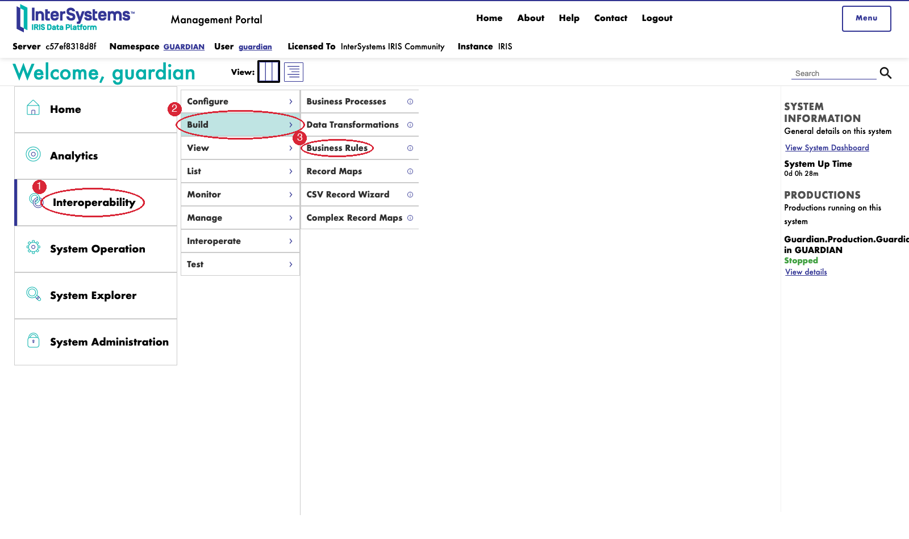
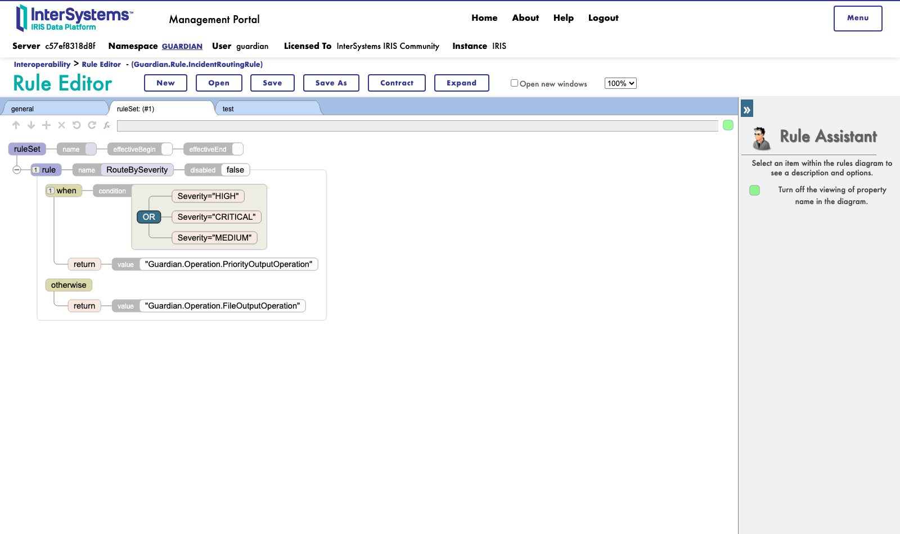

# Roteiro de gravação — vídeo de apresentação (V2)

> Passo a passo operacional **auto-suficiente** para o proprietário gravar
> sozinho: todo comando a rodar, toda URL a abrir (ou menu a clicar) e
> toda fala sugerida estão neste único documento — não é preciso abrir
> nenhum outro arquivo durante a gravação.
>
> **V2 (18/09/2026)** — revisão a pedido do proprietário, `Ajustes.txt`
> itens 6 a 6.7: (1) abertura com fala exata sobre os três módulos;
> (2) todo comando de terminal que é uma única chamada `docker exec`
> agora está numa única linha física, sem quebra por `\`, para colar sem
> risco de o terminal interpretar errado; comandos que são de fato
> vários passos separados aparecem numerados; (3) fala detalhada,
> primeira pessoa, sem pressupor conhecimento de interoperability, para
> comparar o Monitor antes/depois da falha; (4) toda instrução de
> navegação dentro da própria aplicação agora diz qual item clicar no
> menu lateral, não o nome físico da classe/URL; (5) abrir o Business
> Rule Editor ganhou o caminho de cliques exato dentro do Management
> Portal, com screenshot anotado, porque **o parâmetro `?RULE=...` na
> URL não carrega o diagrama sozinho** — é preciso clicar em "Open" e
> navegar o diálogo, isso foi testado ao vivo nesta revisão — e a fala
> sobre busca híbrida ficou detalhada; (6) encerramento com fala exata e
> todos os links necessários. O documento `08_ROTEIRO_GRAVACAO_VIDEO.md`
> original foi mantido sem alteração; este arquivo é a versão para usar
> na gravação.

**Login usado em toda a aplicação e no Management Portal:**
`guardian` / `guardian`.

**Convenção de comandos de terminal usada neste documento** (item 6.3 de
`Ajustes.txt`): todo bloco de código abaixo marcado como "comando único"
é uma única linha física — copie a linha inteira (mesmo que o seu
terminal quebre a exibição em duas linhas visuais) e cole de uma vez só.
Nunca reconstrua o comando digitando `\` no fim de uma linha. Blocos
marcados como "heredoc" (`<<'EOF' ... EOF`) também devem ser colados
inteiros de uma vez — o terminal só executa depois de ver o `EOF` final,
então colar várias linhas de um heredoc de uma vez é seguro e esperado.
Quando há mais de um comando separado dentro do mesmo passo, eles vêm
numerados (1, 2, 3...), cada um no seu próprio bloco.

**Navegação dentro da aplicação** (item 6.5): depois do primeiro login,
nunca é preciso digitar outra URL de página da aplicação — use sempre os
links do menu lateral esquerdo, que têm estes nomes exatos (interface em
inglês, requisito do concurso):

| Clique no menu lateral | Abre |
|---|---|
| **Monitor** | Production Monitor |
| **Investigator** | AI Incident Investigator |
| **RAG Assistant (Gemini)** | RAG Assistant, provedor Gemini |
| **RAG Assistant (Groq)** | RAG Assistant, provedor Groq |

**URLs de referência** (só a primeira, do Monitor, precisa ser digitada
— é a porta de entrada; ajuste a porta se o container publicar em outra,
confira com `docker port iris-guardian`):

http://localhost:53773/csp/guardian/Guardian.UI.MonitorPage.cls

| Tela | Como chegar |
|---|---|
| Production Monitor | Primeira URL a abrir (acima), depois sempre pelo menu **Monitor** |
| AI Incident Investigator | Menu lateral esquerdo → **Investigator** |
| RAG Assistant (Gemini) | Menu lateral esquerdo → **RAG Assistant (Gemini)** |
| RAG Assistant (Groq) | Menu lateral esquerdo → **RAG Assistant (Groq)** |
| Management Portal (home) | `http://localhost:53773/csp/sys/UtilHome.csp` |
| Production Configuration | Management Portal → menu esquerdo **Interoperability** → **Configure** → **Production** |
| Message Viewer | Management Portal → menu esquerdo **Interoperability** → **View** → **Messages** |
| Business Rule Editor | Management Portal → menu esquerdo **Interoperability** → **Build** → **Business Rules** (ver seção 7, caminho exato com screenshot) |

Todos os comandos de terminal abaixo rodam no seu Mac (Terminal.app ou
iTerm), **não** dentro do container — eles chamam `docker exec` por fora.

## 0. Antes de gravar

- [ ] Fechar todas as abas/janelas com dados pessoais (e-mail, favoritos
  do navegador, outras abas do sistema operacional). Screenshots
  anteriores deste projeto já vazaram a barra de favoritos do navegador
  sem querer — **ocultar a barra de favoritos/abas antes de gravar** (ou
  usar uma janela anônima sem favoritos salvos).
- [ ] Confirmar que nenhuma chave de API (Gemini, Groq) vai aparecer na
  tela — elas ficam em `Ens.Config.Credentials`, tela que você não abre
  em nenhum passo deste roteiro (fica em Interoperability → Configure →
  Credentials no Management Portal). Só não abra essa tela específica e
  está seguro.
- [ ] Subir o container, se ainda não estiver rodando:
  ```sh
  docker start iris-guardian
  ```
- [ ] Confirmar que a Production está **Running** (heredoc — cole as 5
  linhas de uma vez, do `docker exec` até o `EOF` final):
  ```sh
  docker exec -i iris-guardian iris session IRIS -U GUARDIAN <<'EOF'
  write ##class(Ens.Director).GetProductionStatus(.tName,.tState),!
  write "Nome: ",tName," Estado: ",tState,!
  halt
  EOF
  ```
  Se `Estado` não for `1` (Running), rodar isto antes de continuar
  (`RecoverProduction()` não recebe argumento nenhum — passar o nome da
  Production dá erro `<PARAMETER>`):
  ```sh
  docker exec -i iris-guardian iris session IRIS -U GUARDIAN <<'EOF'
  set sc=##class(Ens.Director).RecoverProduction()
  write "Recover sc: ",sc,!
  set sc=##class(Ens.Director).StartProduction("Guardian.Production.GuardianProduction")
  write "Start sc: ",sc,!
  halt
  EOF
  ```
- [ ] Deixar os diretórios de mensagens em estado limpo (comando único):
  ```sh
  docker exec -i iris-guardian sh -c 'D=/durable/guardian; rm -f $D/in/* $D/archive/* $D/out/* $D/out_priority/* && chmod 755 $D/out $D/out_priority'
  ```
- [ ] Deixar uma segunda janela de terminal pronta (split de tela ou
  picture-in-picture) — é nela que o loop de tráfego contínuo da seção 2
  vai rodar, visível do início ao fim da gravação.
- [ ] **Dar um refresh forçado no navegador** antes de começar (Chrome
  no Mac: botão direito no ícone de recarregar com o DevTools aberto →
  "Esvaziar cache e atualização forçada", ou Cmd+Shift+R). A UI recebeu
  ajustes de CSS em 17/09/2026 (loader, logo); um cache antigo pode
  mostrar a logo do loader gigante/cortada em vez do badge pequeno e
  elegante.
- [ ] No canto superior da sidebar da aplicação, clicar no botão de
  idioma até ficar **EN** (requisito do concurso: interface em inglês
  na gravação). Confirmar que título da aba do navegador também mudou
  para inglês em cada página que for abrir.
- [ ] Decidir se vai gravar com narração ao vivo ou legendas/dublagem
  depois — cada passo abaixo já tem uma frase pronta para narrar ou
  legendar.
- [ ] Fazer **um ensaio completo sem gravar** primeiro, do início ao
  fim, cronometrando. Corrigir qualquer trava antes da tomada real.

## 1. Abertura (30-60s)

Tela: slide simples (ver prompt de geração abaixo, opcional), ou a
própria home/sidebar da aplicação já logada (primeira URL da tabela
acima), parada, antes de navegar.

**Fala sugerida (dizer com estas palavras, ou adaptar mantendo o
conteúdo):**

> "Este é o IRIS Production Guardian, uma aplicação que construí
> inteiramente sobre a plataforma InterSystems IRIS para resolver um
> problema real de operação: quando algo falha num ambiente de
> integração, alguém precisa entender o que aconteceu, rápido, e não
> pode simplesmente confiar numa resposta genérica.
>
> A aplicação tem três módulos. O primeiro é o **Production Monitor**,
> que mostra em tempo real o estado de cada host da produção — se está
> saudável, degradado ou fora do ar — e quantas mensagens estão
> passando por cada um.
>
> O segundo é o **AI Incident Investigator**. Quando um componente
> falha, eu seleciono o componente e uma janela de tempo, e a IA
> analisa os dados reais da falha e monta uma investigação estruturada:
> o que os dados mostram, qual é a hipótese mais provável da causa, e o
> que não dá para afirmar com certeza. Ela nunca corrige nada sozinha —
> a decisão de agir continua sendo minha.
>
> O terceiro é o **RAG Assistant**, que responde perguntas sobre a
> documentação do próprio projeto citando a fonte real, e se recusa a
> responder quando não tem informação suficiente, em vez de inventar
> uma resposta. Implementei duas versões, uma com Gemini e outra com
> Groq, para mostrar que a arquitetura funciona com mais de um provedor
> de IA.
>
> Tudo isso roda sobre o InterSystems IRIS: a produção de
> interoperabilidade, o armazenamento vetorial da busca híbrida, e a
> orquestração dos três módulos."

### 1.1 Prompt para gerar o slide/fluxo de abertura (opcional, item 6.1.1)

Se quiser um slide visual em vez de (ou antes de) mostrar a aplicação
parada, use o prompt abaixo numa IA geradora de imagem (Gemini, ChatGPT,
Ideogram etc.). Ele já usa as cores reais da identidade visual da
aplicação (`assets/css/iris-guardian-theme.css`), para o slide combinar
com a UI que aparece no resto do vídeo:

```
Design a single widescreen (16:9, 1920x1080) title slide for the
opening of a product demo video called "IRIS Production Guardian",
built on InterSystems IRIS. Style: clean, modern, minimal enterprise
SaaS dashboard aesthetic, flat design, soft shadows, rounded
rectangles, no photorealism, no stock-photo people, no watermarks.

Color palette (use exactly these hex values):
- Primary background: deep navy blue gradient from #0A1965 to #102F8B.
- Accent / highlight color: teal #01989C and cyan #0FD1C4.
- Card surfaces: white #FFFFFF.
- Secondary surface: light gray #F0F3F9.
- Title text: white. Subtitle text: teal #0FD1C4.

Layout: a horizontal BPM-style flow of 3 connected rounded rectangle
cards, left to right, connected by thin teal arrows, on the navy
gradient background. Each card has a simple line icon at the top and a
label + short sublabel below:
- Card 1 — icon: pulse/heartbeat monitor — label "Production Monitor"
  — sublabel "Real-time health of every host".
- Card 2 — icon: magnifying glass over a warning triangle — label
  "AI Incident Investigator" — sublabel "Evidence-based root-cause
  analysis".
- Card 3 — icon: chat bubble with a document — label "RAG Assistant"
  — sublabel "Cited answers from the project's own docs".

Above the flow: bold white title "IRIS Production Guardian", with a
smaller teal subtitle underneath: "Built entirely on InterSystems
IRIS". Keep all text minimal and legible at video-thumbnail distance.
Export as a single flat image, no borders.
```

## 2. Production saudável, mensagens atravessando os hosts em tempo real (1-2 min)

1. Abrir `http://localhost:53773/csp/guardian/Guardian.UI.MonitorPage.cls`
   (login `guardian`/`guardian` se pedir; esta é a única URL de página
   da aplicação que você digita na gravação inteira — as próximas
   trocas de tela são sempre pelo menu lateral). Mostrar `State: Running`
   e os hosts com badge `healthy`.
2. Na segunda janela de terminal, iniciar o loop de tráfego contínuo —
   manda uma mensagem `LOW` a cada 6 segundos, para o Monitor parecer
   uma produção viva (contadores de fila/mensagens se movendo o tempo
   todo) em vez de um disparo único e estático. **Isto é um script
   inteiro — cole o bloco todo de uma vez, não linha por linha:**
   ```sh
   I=0
   DIR=/durable/guardian/in
   while true; do
     I=$((I + 1))
     ID="LOOP-$(date +%H%M%S)-${I}"
     FILE="$DIR/loop_${I}.txt"
     MSG="${ID}|IRIS.Service.OrderIngest|LOW|Trafego continuo de demonstracao #${I}"
     docker exec -i iris-guardian sh -c "echo '$MSG' > $FILE && chown irisowner:irisowner $FILE"
     echo "[$(date +%T)] enviado ${ID}"
     sleep 6
   done
   ```
   (Isto é o conteúdo de `docs/experiments/loop_trafego_saudavel.sh` —
   pode rodar `sh docs/experiments/loop_trafego_saudavel.sh` em vez de
   colar o bloco acima, dá no mesmo, e evita qualquer risco de colagem
   quebrada. Aceita um número como argumento para trocar o intervalo,
   ex. `sh docs/experiments/loop_trafego_saudavel.sh 10`.)

   Deixar rodando em primeiro plano nessa janela **durante toda a
   gravação** (seções 2 a 7) — só interromper com Ctrl+C na seção de
   limpeza, no final. Cada mensagem é severidade `LOW`, roteada para
   `/durable/guardian/out` (via `Guardian.Operation.FileOutputOperation`);
   não interfere na falha controlada da seção 3, que afeta só
   `/durable/guardian/out_priority` (destino exclusivo de
   `CRITICAL`/`HIGH`/`MEDIUM`, decidido por
   `Guardian.Rule.IncidentRoutingRule` — bônus de Business Rules, ver
   seção 7).
3. Voltar para o Monitor na tela e apontar o horário de coleta e os
   contadores de fila/mensagens mudando a cada ~6s, conforme o loop
   envia. Opcional, para reforçar que é tráfego real chegando por
   arquivo, não simulado na interface (comando único):
   ```sh
   docker exec -i iris-guardian ls -la /durable/guardian/out
   ```

**Fala sugerida:** "aqui está o estado saudável, com tráfego real
entrando continuamente — vou guardar essa imagem para comparar depois
da falha."

## 3. Introduzir a falha controlada (2-3 min)

1. Quebrar o destino ao vivo, na tela (comando único):
   ```sh
   docker exec -i iris-guardian chmod 555 /durable/guardian/out_priority
   ```
   Isso remove a permissão de escrita do usuário `irisowner` (dono do
   processo IRIS) no diretório de saída usado por incidentes
   `CRITICAL`/`HIGH`/`MEDIUM` — simula um destino indisponível de
   verdade (disco cheio, permissão negada, share fora do ar), sem tocar
   em nada dentro do IRIS.

   **Fala sugerida:** "estou removendo a permissão de escrita do
   diretório de saída usado por incidentes críticos — simula um destino
   indisponível de verdade, não uma falha fingida na interface."
2. Disparar o incidente que vai falhar (comando único):
   ```sh
   docker exec -i iris-guardian sh -c 'F=/durable/guardian/in/demo3.txt; echo "INC-003|IRIS.Service.PaymentGateway|CRITICAL|Falha de escrita simulada no destino" > $F && chown irisowner:irisowner $F'
   ```
3. Voltar para o Monitor na tela (menu lateral esquerdo → **Monitor**) e
   **esperar ao vivo** (~15-20s — o `FailureTimeout` padrão do
   `Ens.BusinessOperation` é real, não cortar esse tempo no vídeo).

   **Fala sugerida (comparação com a tela anterior — item 6.4, sem
   pressupor que quem assiste conhece interoperability):**

   > "Repare na lista de hosts do Monitor: cada linha é um componente
   > que processa mensagens dentro da produção. Duas delas — o
   > `FileIncidentService`, que recebe os arquivos de incidente, e o
   > `FileOutputOperation`, que escreve as saídas normais — continuam
   > verdes, ou seja, saudáveis, processando normalmente, porque o
   > tráfego contínuo do loop que deixei rodando não usa o destino que
   > acabei de bloquear.
   >
   > As outras duas mudaram de cor, de verde para amarelo: o
   > `IncidentRouterProcess`, que é o componente que decide para onde
   > cada incidente deve ir, e principalmente o
   > `PriorityOutputOperation`, que é exatamente o componente que
   > tentou escrever no diretório que eu bloqueei no passo anterior.
   > Amarelo aqui significa `degraded` — degradado, não fora do ar.
   >
   > O que isso mostra na prática é que a falha é isolada: ela não
   > derrubou a aplicação inteira, só o caminho específico que estava
   > tentando escrever no destino problemático. O tráfego normal, que
   > passa pelo caminho verde, nem percebeu que algo deu errado — e
   > isso vai ficar ainda mais claro no próximo passo, olhando os
   > contadores."

   Nesse meio-tempo o loop de tráfego (seção 2) continua rodando na
   outra janela — apontar que os contadores de
   `Guardian.Operation.FileOutputOperation` (caminho normal, severidade
   LOW) continuam subindo normalmente enquanto só o operation de saída
   prioritária degrada.
4. Confirmar o erro real via SQL ao vivo (guardar o `ID` da última
   linha com `TargetConfigName = Guardian.Operation.FileOutputOperation`
   e `ErrorStatus` diferente de `1` — vai precisar dele na seção 6 se
   for demonstrar o reenvio manual por comando). **Heredoc — cole as 6
   linhas de uma vez:**
   ```sh
   docker exec -i iris-guardian iris session IRIS -U GUARDIAN <<'EOF'
   set st=##class(%SQL.Statement).%New()
   set sc=st.%Prepare("SELECT ID,TargetConfigName,Status,ErrorStatus FROM Ens.MessageHeader ORDER BY ID DESC")
   set rs=st.%Execute()
   do rs.%Display()
   halt
   EOF
   ```
   Deve aparecer `ERROR #5005: Cannot open file
   '/durable/guardian/out_priority/incident_INC-003.txt'`, embrulhado em
   `<Ens>ErrFailureTimeout`. Alternativa visual (mais direta para
   gravar): no Management Portal, clicar em **Interoperability** (menu
   esquerdo) → **View** → **Messages** e mostrar a mensagem com erro na
   lista.

   **Fala sugerida:** "aqui a falha é real, não simulada na interface —
   o processo tentou escrever e o sistema operacional recusou."

## 4. Abrir o incidente no AI Incident Investigator (2-3 min)

1. Clicar em **Investigator** no menu lateral esquerdo da aplicação.
2. Selecionar o componente `Guardian.Operation.PriorityOutputOperation`
   e uma janela de tempo que cubra o momento da falha (ex. 60 minutos).
3. Clicar em "Investigate". A tela escurece com um overlay (logo
   Production Guardian + spinner animado) até a análise da IA terminar
   — comportamento normal, não é travamento; o overlay fica visível
   durante todo o processamento real, inclusive se a chamada à IA
   demorar vários segundos. Bom momento para narrar "a IA está
   analisando agora, em tempo real".
4. Rodar a análise e **ler na tela, para a câmera**, a separação entre
   observação (o que os dados mostram), hipótese (o que provavelmente
   causou) e lacunas (o que não dá para afirmar com os dados
   disponíveis) — esse é o ponto central do DoD: "fundamenta hipóteses
   em evidências e não executa remediação automática". Não clicar em
   nada que sugira "corrigir automaticamente" — não existe esse botão,
   e a fala deve deixar claro que a decisão de corrigir é humana.

## 5. Perguntar aos dois RAG Assistants (3-4 min)

Perguntas já calibradas contra o corpus real do projeto (10 perguntas
testadas, limiar de abstenção 0.58; as relevantes ficaram entre
0.668-0.761 de similaridade, as irrelevantes entre 0.507-0.521 — gap
limpo, sem ambiguidade). Usar exatamente as perguntas abaixo para
garantir que a gravação dá certo na primeira tentativa. Assim como no
Investigator (seção 4), clicar em "Ask"/"Perguntar" escurece a tela com
o mesmo overlay de carregamento até a resposta chegar — normal, não
cortar.

1. Clicar em **RAG Assistant (Gemini)** no menu lateral esquerdo.
   Perguntar:
   > "Qual a causa do erro #5005?"

   Esperado: resposta com citação real de fonte (documento do corpus,
   similaridade ~0.67), ligando ao erro que acabou de ser gerado ao
   vivo na seção 3. Abrir a fonte citada na tela para mostrar que não é
   invenção.

2. Ainda no RAG (Gemini), perguntar uma pergunta **sem suporte no
   corpus**, para demonstrar abstenção:
   > "Qual a receita de bolo de chocolate?"

   Esperado: o modelo responde que não sabe / não há informação
   (similaridade real ~0.52, abaixo do limiar 0.58) — **não deve
   inventar uma resposta**. Momento de narrar: "aqui o sistema se
   recusa a responder porque não há nada no corpus sobre isso — isso é
   a abstenção calibrada, não um bug."

3. Clicar em **RAG Assistant (Groq)** no menu lateral esquerdo e
   repetir a pergunta 1 ("Qual a causa do erro #5005?"). Mostrar que o
   segundo provedor também responde com citação — reforça que
   retrieval/embeddings são os mesmos (Gemini) e só o modelo de geração
   muda (Groq, `openai/gpt-oss-120b`).

Se alguma dessas perguntas não repetir o resultado esperado no dia da
gravação (ex.: corpus mudou), **não inventar** — gravar o resultado real
e ajustar a fala, nunca a tela.

## 6. Corrigir o destino e mostrar recuperação (2 min)

1. Corrigir a permissão (comando único):
   ```sh
   docker exec -i iris-guardian chmod 755 /durable/guardian/out_priority
   ```
2. Mostrar recuperação automática para tráfego novo (comando único):
   ```sh
   docker exec -i iris-guardian sh -c 'F=/durable/guardian/in/demo4.txt; echo "INC-004|IRIS.Service.PaymentGateway|LOW|Fluxo normal apos recuperacao do destino" > $F && chown irisowner:irisowner $F'
   ```
   Aguardar ~10s, mostrar `incident_INC-004.txt` aparecendo em `out/` e
   o Monitor voltando para `healthy`.
3. Explicar que a mensagem `INC-003` que falhou **não** é reentregue
   sozinha — o `FailureTimeout` já expirou antes do destino ser
   corrigido, então aquela tentativa específica ficou definitivamente
   marcada como falha (comportamento real e documentado do framework,
   não uma limitação do código). Duas formas de mostrar o reenvio
   manual, se quiser demonstrar ao vivo (opcional):
   - **Pelo Message Viewer** (mais direto para gravar): no Management
     Portal, clicar em **Interoperability** (menu esquerdo) → **View**
     → **Messages** → selecionar a mensagem do `INC-003` com erro →
     botão **Resend**.
   - **Por comando**, usando o `ID` anotado na seção 3, passo 4
     (heredoc — cole as 4 linhas de uma vez):
     ```sh
     docker exec -i iris-guardian iris session IRIS -U GUARDIAN <<'EOF'
     set sc=##class(Ens.MessageHeader).ResendMessage(<ID_DA_MENSAGEM>)
     write "Resend sc: ",sc,!
     halt
     EOF
     ```
   Confirmar `incident_INC-003.txt` aparecendo em `out_priority/` depois
   do reenvio.

**Fala sugerida:** "o sistema se recupera sozinho para tráfego novo, sem
reiniciar nada — e nada foi escondido ou fingido como sucesso enquanto
a mensagem antiga continuava marcada como falha."

## 7. Bônus implementados (2-3 min)

### 7.1 Business Rules routing

O caminho abaixo foi testado ao vivo nesta revisão: **o link direto
`EnsPortal.RuleEditor.zen?RULE=Guardian.Rule.IncidentRoutingRule.cls`
não carrega o diagrama da regra sozinho** — ele só define o nome que
aparece na barra de navegação, mas a área de edição fica vazia até você
clicar em "Open" e escolher a regra manualmente. Por isso, siga os
cliques abaixo em vez de confiar só na URL:

1. No Management Portal, clicar em **Interoperability** no menu lateral
   esquerdo.
2. Clicar em **Build**.
3. Clicar em **Business Rules**.

   

4. Isso abre o Rule Editor vazio. Clicar no botão **Open** no canto
   superior direito.
5. No diálogo que abre, clicar duas vezes em **Business Rules** (ícone
   de pacote verde) → depois em **Rule** → depois em
   **IncidentRoutingRule** — ou selecionar o nome e clicar **OK**.
6. A regra carrega assim:

   

**Fala sugerida:**

> "Este é o Business Rules Editor do IRIS — um editor visual de regras
> de negócio. A regra que estou mostrando, `RouteBySeverity`, é a que
> decide para onde cada incidente vai: se a severidade for `HIGH`,
> `CRITICAL` ou `MEDIUM`, a regra devolve o nome do
> `Guardian.Operation.PriorityOutputOperation` — o destino prioritário
> que acabei de testar na falha controlada. Para qualquer outra
> severidade, ela devolve o `Guardian.Operation.FileOutputOperation`, o
> destino normal. O ponto importante aqui é que essa decisão de
> roteamento é configurável visualmente, sem recompilar nada — se eu
> quisesse adicionar uma quarta severidade ou trocar o destino, eu
> editaria essa regra aqui e recompilaria só ela, sem tocar no código
> dos outros componentes. É exatamente essa regra que decidiu, nas
> seções 3 e 6, mandar o `INC-003` e o `INC-004` para destinos
> diferentes."

### 7.2 Hybrid search

Não precisa clicar em nada além do que já foi feito na seção 5 — é uma
decisão de arquitetura que já rodou por trás de toda pergunta feita ao
RAG Assistant. Só narrar:

**Fala sugerida (detalhada, item 6.6):**

> "A busca do RAG Assistant não usa só uma técnica, ela combina duas. A
> primeira é busca vetorial: a pergunta do usuário é transformada num
> vetor numérico, um embedding, e comparada por similaridade com o
> vetor de cada trecho da documentação — isso captura o significado da
> pergunta, mesmo que as palavras exatas sejam diferentes das do
> documento. A segunda é busca lexical, usando o índice de texto
> completo nativo do IRIS, o iFind — isso captura correspondências
> exatas de palavras-chave, que a busca por significado às vezes não
> prioriza.
>
> Os dois rankings são combinados por um método chamado Reciprocal Rank
> Fusion: cada busca contribui com até 15 candidatos, e a posição de
> cada trecho nos dois rankings é combinada matematicamente para montar
> os 5 trechos finais que a IA usa para responder.
>
> Na prática, isso significa: se a pergunta usa um termo técnico exato
> que aparece literalmente na documentação, a busca lexical ajuda a
> garantir que esse trecho apareça; se a pergunta é feita com outras
> palavras, a busca vetorial ainda encontra o trecho certo pelo
> significado. A decisão de abstenção, aliás, continua baseada só na
> melhor similaridade vetorial pura — não muda por causa da fusão
> híbrida, para não invalidar a calibração que testei."

### 7.3 PublicHealth bonus

Mencionar que existe uma segunda Production
(`PublicHealthProduction`), que consome uma API pública real
(`disease.sh`) e trata indisponibilidade sem inventar dados. Se quiser
mostrar ao vivo (só uma Production roda por namespace, então precisa
parar a atual primeiro — decidir se vale o tempo de vídeo ou só citar
com print/trecho de código):

```sh
docker exec -i iris-guardian iris session IRIS -U GUARDIAN <<'EOF'
do ##class(Ens.Director).StopProduction()
set sc=##class(Ens.Director).StartProduction("Guardian.Production.PublicHealthProduction")
write "Start PublicHealth sc: ",sc,!
halt
EOF
```

Para voltar à Production principal depois (necessário para o resto do
roteiro, se gravar isso fora de ordem):

```sh
docker exec -i iris-guardian iris session IRIS -U GUARDIAN <<'EOF'
do ##class(Ens.Director).StopProduction()
set sc=##class(Ens.Director).RecoverProduction()
set sc=##class(Ens.Director).StartProduction("Guardian.Production.GuardianProduction")
write "Start Guardian sc: ",sc,!
halt
EOF
```

## 8. Metodologia com IA (1 min)

Mostrar a pasta `entregaveis/Prompts/` no Finder ou editor de código —
10 arquivos com a sequência real de prompts por fase/bônus, com os erros
reais encontrados e corrigidos. Não precisa ler o conteúdo na tela, só
apontar que existe e abrir um arquivo rapidamente como exemplo.

## 9. Encerramento (30-45s)

**Fala sugerida (item 6.7, exata, com tudo o que você precisa citar):**

> "Esse foi o IRIS Production Guardian: um Production Monitor em tempo
> real, um AI Incident Investigator que fundamenta hipóteses em
> evidência sem executar nada sozinho, e um RAG Assistant que cita a
> fonte e sabe dizer que não sabe. Além do escopo obrigatório, entreguei
> quatro bônus: roteamento por Business Rules, busca híbrida vetorial e
> lexical, um segundo provedor de IA para geração de resposta, e uma
> segunda produção que integra uma API pública de saúde. Todo o código
> está aberto no repositório GitHub — o link está na descrição deste
> vídeo. Obrigado por assistir."

**Links a citar/mostrar** (para você não precisar lembrar de nada fora
deste documento):

- Repositório GitHub (já existe, pode citar/mostrar na tela):
  `https://github.com/sergiofsq/iris-production-guardian`
- Link do vídeo publicado e link no Open Exchange: **ainda não existem
  no momento da gravação** — só serão criados depois que o vídeo for
  publicado, então não têm como ser citados na fala. Ficam para
  preencher depois em `entregaveis/Artigo_Comunidade_PT.md` (ver
  checklist final).

## Limpeza pós-gravação

1. Parar o loop de tráfego (seção 2) — Ctrl+C na janela onde ele está
   rodando, ou, se foi deixado em segundo plano: `pkill -f
   loop_trafego_saudavel` (ou `pkill -f "durable/guardian/in"` se rodou
   o bloco colado em vez do script).
2. Limpar os diretórios (comando único):
   ```sh
   docker exec -i iris-guardian sh -c 'D=/durable/guardian; rm -f $D/in/* $D/archive/* $D/out/* $D/out_priority/*'
   ```
3. Deixar a Production `Running` (estado padrão entre sessões) — se
   tiver testado o bônus PublicHealth (seção 7), confirmar que voltou
   para `Guardian.Production.GuardianProduction`, não
   `PublicHealthProduction`.

## Checklist final antes de publicar o vídeo

- [ ] Nenhuma chave de API, senha ou dado pessoal visível em nenhum
  frame (revisar principalmente aberturas de terminal e barra de
  favoritos do navegador).
- [ ] Interface e texto em inglês na tela (requisito do concurso) — o
  toggle EN no canto superior da sidebar reflete corretamente em todas
  as 4 páginas (auditado em 17/09/2026).
- [ ] Nenhum corte esconde uma espera real ou sugere um tempo falso de
  recuperação.
- [ ] Preencher, depois de publicado, o link do vídeo em
  `entregaveis/Artigo_Comunidade_PT.md`.
